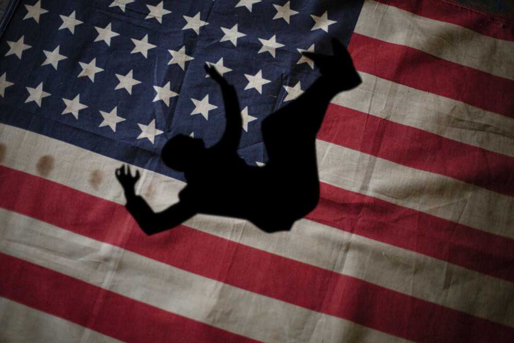

>>"Optimism is Cowardice." -Oswald Spengler

It's difficult not to comment on the election. Tommorrow it will finally be over. Given the catastrophe that has unfolded over the last four years from a reality TV star running the country, I hope for a Biden landslide. But the truth is noone is discussing the most pertinent issues facing our world today.  

Science denial is our country's greatest risk. It's time to wake up. It's been a long year of ignorance and anti-intellectualism. From [COVID-19 conspiracy theories](https://www.theguardian.com/books/2020/oct/30/no-covid-19-isnt-a-plandemic), [to the flat earther phenomenon](https://www.scientificamerican.com/podcast/episode/flat-earthers-what-they-believe-and-why/), [to QAnon](https://www.vox.com/2020/10/9/21504910/qanon-conspiracy-theory-facebook-ban-trump), our nation is overrun with toxic ideas. It's in our faces. It's all around us. America cannot survive without facing reality.

We stand at evolutionary crossroads. Either we develop institutions compatible with our current technological and scientific development, or we keep repeating our old dead rituals. Climate change, the development of artifical intelligence, the rise of high tech terrorism, nuclear proliferation, these are our true risks. Only a rigorously scientific perspective can address them. 

On the world stage, America used to be known for its pragmatism. It's survival instincts. We were the nation of people unbridled by tradition, religion, or outdated aristocracies. We had the ingenuity necessary to adapt and evolve. Now we are the dinosaurs facing extinction. The last half century has been an unparalleled time of scientific expansion. More scientific discoveries have been made in the last ten years than in all of world history combined. And yet, we continue to allow ourselves to be governed by the words of dead men. We stare into the Constitution, like soothsayers into tea leaves, looking for solutions to modern problems. We seek the advice of actors and reality TV stars over that of scientists and academics. America will continue to decline unless we choose truth over comforting lies. Nature has one law: Adapt, adapt, adapt. Failure to do this will be our destruction.
