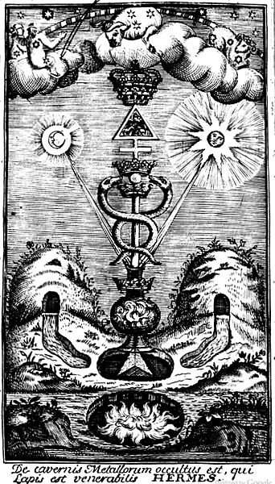
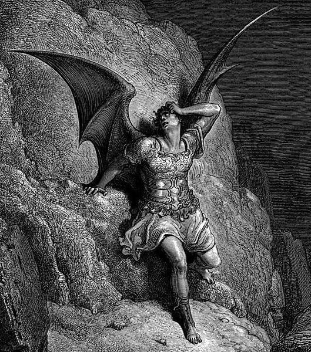
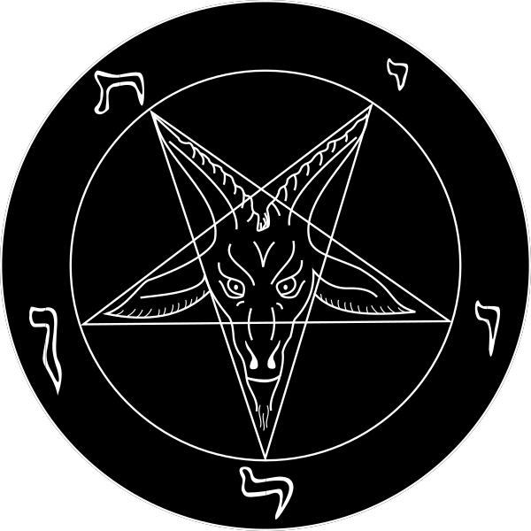

.

> "I was in the death struggle with self: God and Satan fought for my soul those three long hours. God conquered — now I have only one doubt left — which of the twain was God? -Aleister Crowley."

Every human wants to be a god. We are driven from within toward greater expansion of the Self. More power. More knowledge. Greater awakening. Our earliest ancestors with moon-light sacrificial rituals and the modern psychonaut hypnotically tripping to EDM have the same goal. Self-Realization. Cosmic Consciousness. Self-deification. 

No one wants to be a slave. And yet the world is filled with religions, institutions, and traditions that train us to be docile, subservient, and domesticated. Everything in our soul cries out for freedom, everything in our civilized life keeps us in a cage.

In traditional Judeo-Christian mythology the Serpent was a figure of evil, coaxing Eve from a state of pristine happiness into chaos and destruction. "Ye shall be as gods" (Genesis 3:5). These traditions make our innate drive toward self-evolution the cardinal sin from which all others flow. Let's consider another interpretation of this myth. Greek mythology provides a unique counter-point in the story of Prometheus. He brought Divine fire down to man, awakening us from a state of perpetual animal subservience to the gods. This is why subversive mystical traditions in Christian cultures have always seen Lucifer as a figure of enlightenment, reason, and radical individuality.

We now live in the postmodern era. All mythologies stand utterly shattered by the weight of Reason. God is dead, but our drive toward Self-realization remains. It's time to consider radical possibilities. It is the duty of the postmodern mage to see further than our ancestors could. Our mythologies must be our own. Our techniques for advancing Consciousness will not be those of the past. God will not save us. Dead rituals and rigid dogma will not save us. Our spiritual evolution is in our own hands.

Why should it be any other way? Truth is for the courageous, the daring, the intellectually strong. Unbridled by tradition, taboos, or dogma, a whole new generation of spiritual seekers must conduct experiments in their own Consciousness. Let us drop acid, munch shrooms, biohack our brains, and meditate in sensory deprivation tanks. May EDM clubs become spaces of psychic transformation. May new cults and grottos open in the place of ancient Cathedrals. There should be no limit to what we're willing to do in driving our collective and individual Consciousness to the very heights of sublime experience. 

Here I will be publishing a series of essays feeling out some conceptual starting points for anyone on the path of Apotheosis. From techno-pagans to psychonauts, Luciferian shamans to psychedelic alchemists, my hope is everyone will find something useful for their psychic development. Here I will discuss the occult, psychonautics, Chaos Magick, Entheogens, and the coming Occult revolution. May all beings shatter their mental boundaries and attain ultimate Transcendence. More to come soon. 

