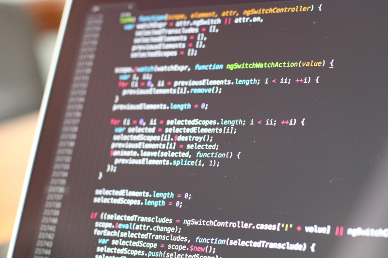

>"Change is the law of life. And those who look only to the past or the present are certain to miss the future." -JFK

Technology is the revolutionary force of our time. It affects every facet of our modern lives. Finance, manufacturing, politics, mass media, warfare, no part of our world resembles that of our grandparents. This change is constant, rapid, and unpredictable; and yet, the institutional power structures meant to protect us and secure our future have changed very little since the Enlightenment. This is a recipe for disaster.

Nowhere is this disaster unfolding more rapidly than in the sphere of cybercrime. [By next year the total losses from cybercrime will exceed 6 trillion dollars.](https://cybersecurityventures.com/hackerpocalypse-cybercrime-report-2016/) [A cyber attack occurs every 39 seconds worldwide.](https://www.varonis.com/blog/cybersecurity-statistics/) We are living through the greatest transfer of wealth in human history. Governments around the world cannot contain this problem. [Less than five percent of hackers ever get caught and prosecuted.](https://www.cybersecurityintelligence.com/blog/some-hackers-earn-2m-a-year-5083.html#:~:text=Only%20around%204%2F5%25%20of,arrest%20and%20prosecute%20these%20offenders.) Many nations don't even have the necessary laws to safeguard their citizens against cybercrime. Those with more robust legal systems are still helpless against hackers outside of their borders.

Adding to the problem, never before has the barrier to entry to such a lucrative criminal field been so low. [Stories of highschoolers pulling off multi-million dollar hacks are increasingly common.](https://www.dailymail.co.uk/news/article-8351735/High-schooler-termed-Baby-Al-Capone-allegedly-hacked-phones-pull-23-8-million-crypto-heist.html) This year Twitter was hacked exposing the accounts of Bill Gates, Elon Musk, and Barack Obama. The mastermind behind the attack was 17. Between 2001 and 2002, Gary Mckinnon hacked computers owned by the US military and NASA costing them over $700,000 in damage. He was no computer genius. He was systems administrator who had previously worked as a hairdresser. When asked for his motivation behind the attacks, he revealed an obsession with UFOs and free energy conspiracy theories.

We're entering a time when anybody with basic networking skills and an internet connection can challenge the most powerful goverments and corporations in the world. With global markets in decline, unemployment up, and outdated, ineffectual legal systems in place, a silent revolution is taking place and the institutions we once trusted for safety can only watch helplessly as power shifts hands.  

I'm starting this blog with the intention of chronicling these changes as they develop and educating the public on cybersecurity issues. If you want to know how to survive in the coming era of technological chaos you're in the right place. Here I will post news, commentary, interviews and tech tutorials for staying on the bleeding edge of cyber security. For more information, reach out to me on [Twitter](https://twitter.com/gunnar_bachelor).
